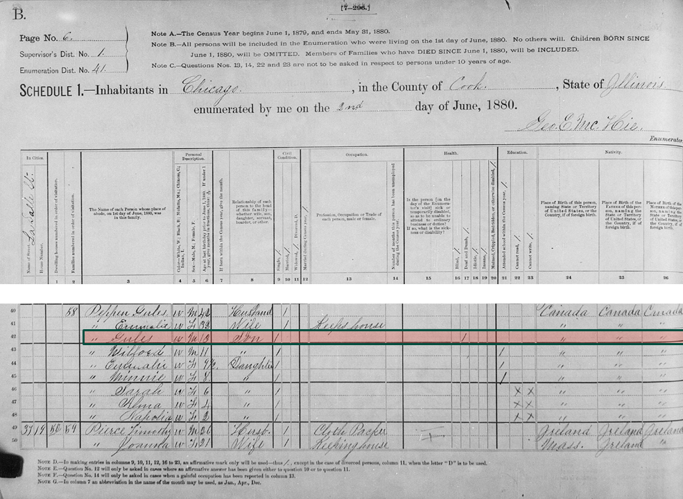
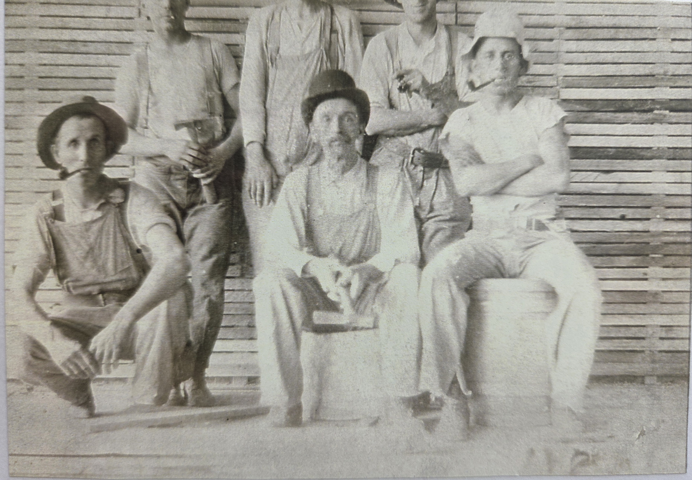
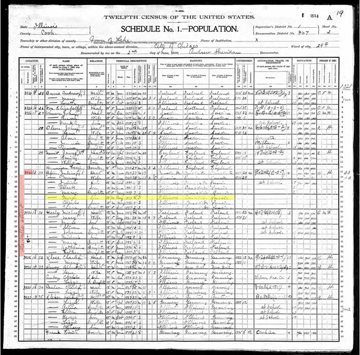
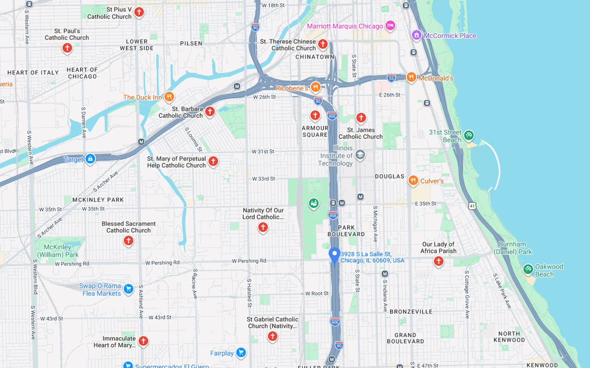
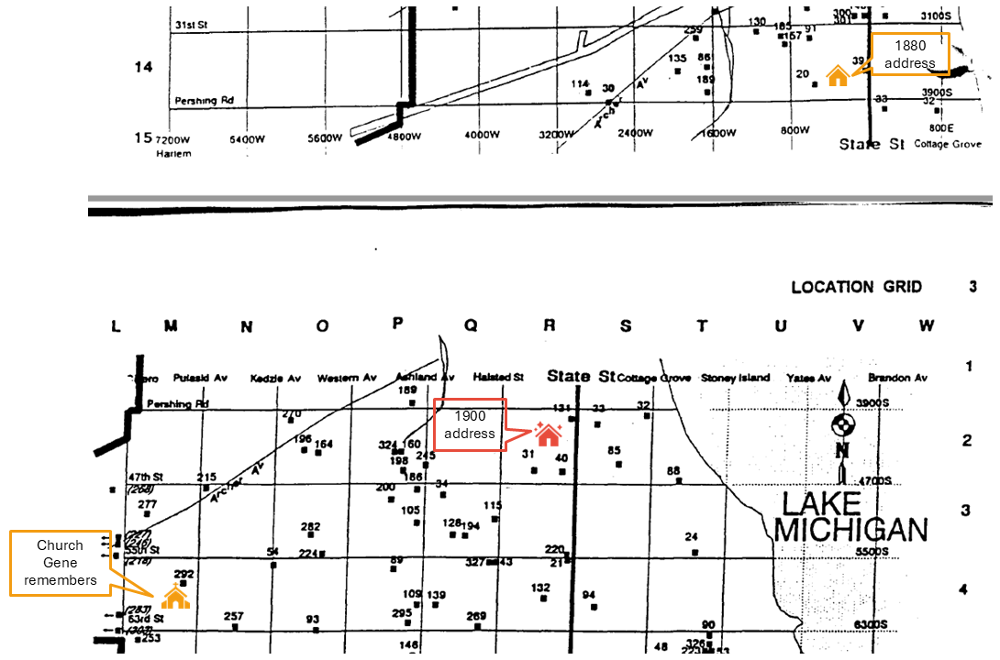
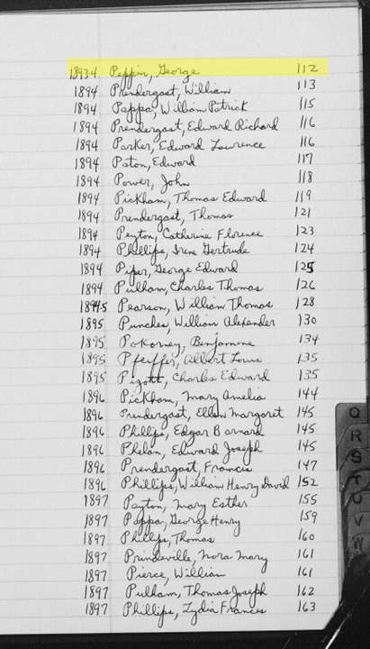
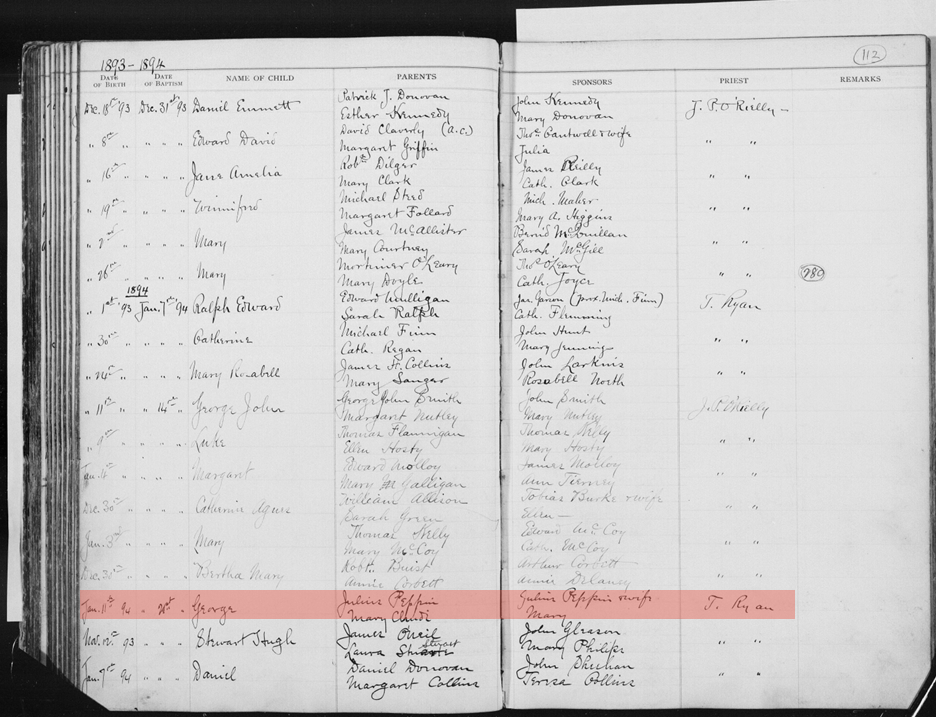

The next step in my document hunt for my [Canadian citizenship by decent application](https://joannapepin.com/posts/welcome/) was to find my great grandfather George's birth record. Riding high from reading [1800 baptism records in cursive French](https://joannapepin.com/posts/jules/), I thought finding George's birth record would be so much easier. The 1880 US census record showed the family living in Chicago when [Jules](https://joannapepin.com/posts/jules/) was 13 years old. So, George's records should be in English and with any luck, there might even be a birth certificate/record rather than a baptism record. 

{group="my-gallery"}
  
It turns out, I was over confident and documentation of George's birth was even more challenging than Jules (George's dad).

::::: columns
::: {.column width="40%"}

The following is the account of how I eventually found what I needed, but my memory is a bit fuzzy and the strategy was far more circular than this writing will make it appear.

:::

::: {.column width="60%"}

{group="my-gallery" width="90%"}

:::
:::::

We learned that county clerks in [Illinois began recording births in 1877](https://www.ilsos.gov/departments/archives/gen-research.html), though these records weren't mandated by the state until 1916. [FamilySearch.org](FamilySearch.org) had a few documents for George (e.g., draft card, SSI) noting his birthday as January 5, 1894, so I was hopeful a record existed. I spent a lot of time looking through every possible database and index on FamilySearch that I could find. Some of the IL christening records have already been indexed on FamilySearch as well, but George's was unfortunately not one of them. A check of the Ancestry website also did not show any sources for his birth record. Eventually, I came to accept that his birth must not have been reported to the government, and I was going to need to hunt for a baptism record again.

Building on the experience with finding Jules's baptism, it made sense to start by locating the family address closest to the date George was born (1894) in order to identify nearby churches. Unfortunately, we were unable to locate an address for the family from the 1890 US Census, likely because it was [burned in a fire](https://www.census.gov/about/history/stories/monthly/2021/january-2021.html) that destroyed most of these records. So, turning to the 1900 US Census, I could see the family was living at 3928 La Salle street in Chicago.

{group="my-gallery"}

The Google map search of Catholic churches nearby the address was a bit confusing. On the one hand, it seemed like a bad sign that the current address appears to be in the middle of I-90. On the other hand, there were a handful of churches nearby. FamilySearch.org has an inventory of records for [200 churches in the Diocese of Chicago](https://www.familysearch.org/en/wiki/Illinois,_Chicago,_Catholic_Church_Records_-_Inventory), so I started with the three closest churches surrounding the address. The microfiche images of the records are available online, so it requires clicking through the images, ideally through the index if there is one, or looking at the baptism images for around the date one might expect a baby born in January to have been baptized. I couldn't find it in any of these churches, so I repeated the process for all of the other churches on the map that were available in this way.  

{group="my-gallery"}

When that didn't work out, Chris and I decided we needed to replicate what we did for Jules and find a map of old churches. It was possible that the church closed and that it wasn't coming up on the Google map search. We discovered that the Archdiocese of Chicago has a downloadable [book with maps of Chicago city parishes](https://archives.archchicago.org/genealogy-resources) with dates and ethnicity of the parishes. It also compiled a downloadable Excel spreadsheet of the data which makes limiting the 200 parishes a bit easier. This book turned out to be the critical piece of our search, as the church holding the baptism record has indeed closed, but it also sent us hunting in the wrong direction for awhile. 

It was a bit difficult to find the La Salle address on the map. Chicago street names and numbering were changed in the early 1900s, and given the home address is a spot on today's interstate highway, we were estimating the location. Adding to the complication, the address we were looking for was at the bottom/top of the two-page map. Our mapped address was located right across Pershing Rd, and the preface of this book stated: "*The maps in this guide (not to true scale) are divided into two halves for each set of years that I refer to as upper city and lower city, Pershing Road (3900S) being the dividing line.*" So, we weren't really sure where the house was located. It was another day or two before we got the house precisely marked on the map.

We filtered the corresponding Excel file to French ethnicity, as this seemed to be a key demographic detail in the description of the churches in this book and on FamilySearch, and it seemed to make sense that we'd be looking for French speaking churches. We eliminated all churches that were founded after 1894 and then looked at each microfiche collection for churches that seemed reasonably close to our estimated area for the house. This led to nothing. 

{group="my-gallery"}

Since we didn't have the 1890 US Census, we identified the previous family address as listed in the 1880 US Census and looked at records from the French churches nearby. This seemed promising because the family had only moved south on La Salle street in the 20 years, so maybe they weren't too far away when George was born. Notice on the map that we've marked the La Salle street houses just to the left of State street, and that State street appears in different places on the top and bottom page. This led to a lot of confusion for awhile.

Ultimately, this turned up nothing too. Then, we looked at French speaking churches close to the next address we had for the family, as reported in the 1910 US Census. This was the address my family remembers, a tiny house located on Carpenter Street further south on the map, near train tracks. We hypothesized that the family may have moved to this neighborhood because they already had a community there. This too was fruitless.

When all of that led to a dead-end, we tried to find neighborhoods where French Canadians landed in Chicago. These appeared to be somewhat nearby but west of the La Salle addresses. We knew from the census records that George's mom was Polish, so we briefly tried to find Polish churches but they were not well labeled in our research documents. A search of all these church records also turned up nothing. 

At some point in this search, we found an article documenting Jules and Mary's (George's parents) 50th wedding anniversary. The anniversary was noted in the Chicago Daily News as a milestone event because they were the first known deaf couple in the area to reach their Golden anniversary (more on that another time!). I had known at some point, but had forgotten learning that my grandfather's grandparents were deaf. Suddenly, the search for French speaking churches seemed a bit silly. So, off we went looking for historical churches for the deaf. This was also leading to dead ends, as many of these records were not available online, but it was starting to feel like an explanation for why we couldn't find a baptism record. Still, without strong evidence that was the reason, I kept searching.

We searched church records at all the French churches nearby the addresses located in the newspaper article (e.g., their current church, previous church). I also found a written memory from my grandfather of a Chicago church he attended as a child. The records from that church also failed to turn up anything notable.

Finally, we decided to find exactly where on the map the 1900 La Salle address was and work from proximity, ignoring the listed ethnicity of the churches. The closest church, #31, was Irish church St. Gabriel which we had already ruled out in the initial search of currently active churches. Church #40 was St. Cecilia, listed as an Irish church and church #131 was St. George (would have been ironic!) listed as a German church. Late into the evening, when I should have been heading to bed, I finally found George Pepin at the top of the page of the microfiche for St. Cecilia! 

{group="my-gallery" width="50%"}

We clicked through the microfishe until we found his baptism record. Unlike Jules' record which was in paragraph form, this one was a single line entry. Importantly, it had all the pertinent information, linking George to Jules. 

{group="my-gallery"}

It lists his birth date as January 11, 1894 and his baptism took place on January 21st, 1894. This was a bit surprising, because the other documentation available for George (draft card, SSI, tombstone) all list his birthdate as January 5th. It's a mystery if the date got recorded incorrectly or if somewhere along the way, it got mis-remembered. 

**The sage continues:** At the time, this document was enough to submit my application for Canadian citizenship, linking Jules and George. I included copies of both these pages, the front page of the record book, and the direct url link to the record on FamilySearch. Since then, [Immigration, Refugees and Citizenship Canada (IRCC) has updated their application instructions](https://www.cicnews.com/2026/07/irccs-proof-of-citizenship-review-what-happened-changed-what-to-do-if-youre-impacted-0777677.html), and now require records from the “original” source authority. 

This means, the rest of my family likely needs a certified copy of this record to apply for Canadian citizenship. To get it, this archive holding the record requires family members provide certified copies of birth and death certificates for anyone between the person making the request and the person whose record is requested (George). Meaning, we need my grandfather's birth and death certificate before my dad (or his siblings) can request it. We have a copy of my grandfather's death record and we're now waiting on Illinois to provide us with a copy of his birth certificate. 

It is possible that IRCC would accept copies of the US Census records linking George to Jules (his father) and Gene (his son) and use this baptism record as substantiating evidence, but no one know for sure at this time what is considered sufficient evidence. 

