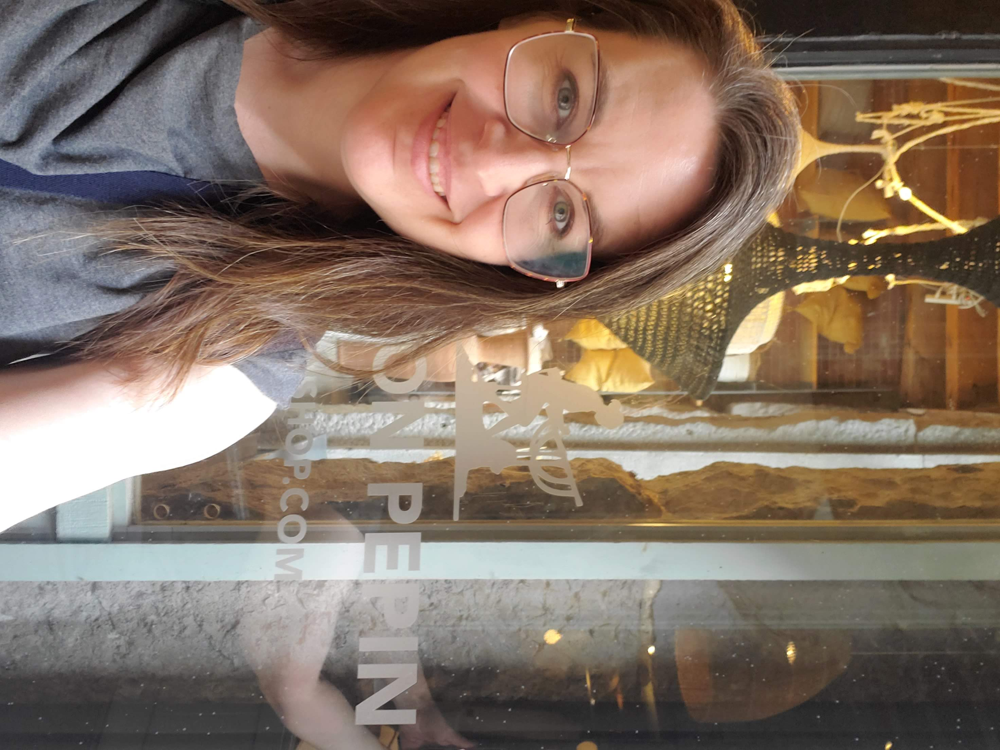
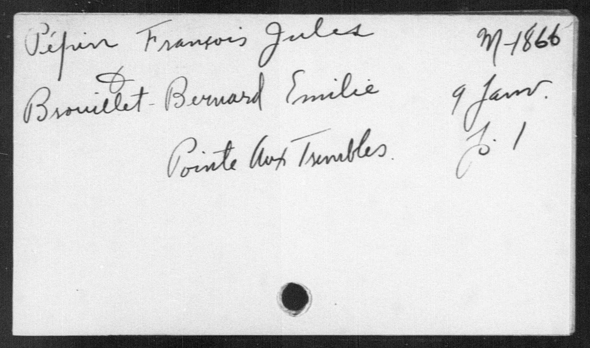
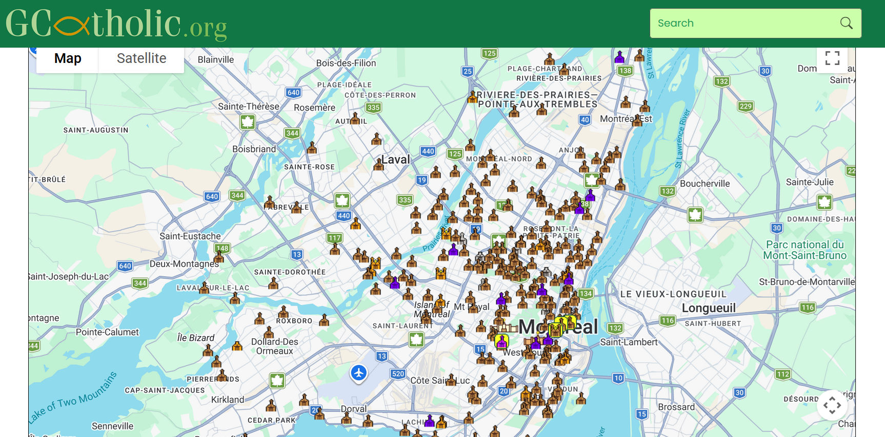
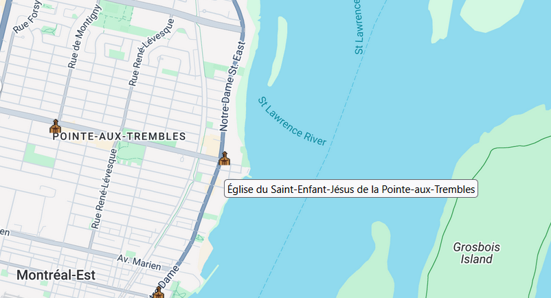
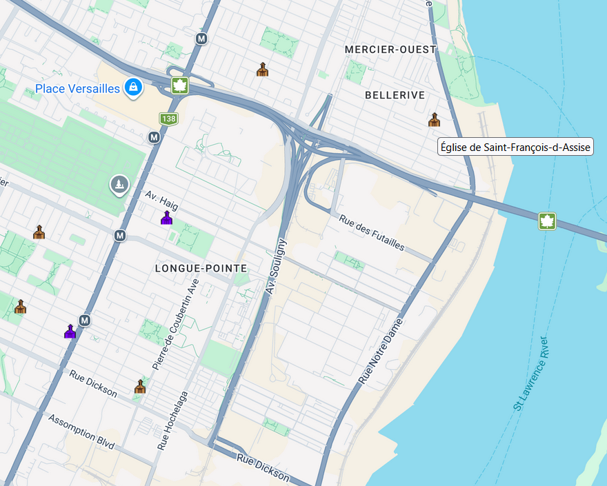
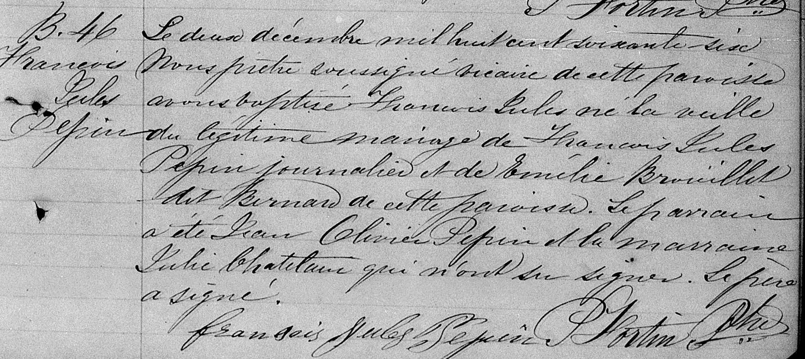

This is the story of how I found my French Canadian ancestor's baptism record, a critical step in [proving my Canadian Citizenship](https://joannapepin.com/posts/woke-up/). I had no idea how fun it was going to be to look at 1800s Canadian census records, maps of old Catholic churches, or to attempt to read baptism records in French cursive.

::::: columns
::: {.column width="60%"}
Whenever I asked about my heritage, I was told that my dad's ancestry was likely French Canadian. But the story didn't usually come with any specific details. There were other hints my family was from Québéc. I once excitedly took a picture outside a cute boutique, named [*Maison Pepin*](https://maps.app.goo.gl/GMrqvKgumGnDHnGW7), on a trip to Montréal. It's rare that I see my last name anywhere. An airline check-in agent in the city once teased me about my pronunciation of my last name. However, I didn't really know how far back in my family line I'd have look to establish a Canadian ancestor. I thought it might be many generations removed. 
:::

::: {.column width="40%"}
{width="90%"}
:::
:::::

To begin my search, I started by looking for my grandfather's (Gene Pepin)  birth certificate. A Google search eventually indicated it was accessible for free from a public library (libraries are the best!) on [FamilySearch.org](FamilySearch.org). It turns out that FamilySearch.org is run by the Church of Jesus Christ of Latter-day Saints (aka Mormons), who aim to create the largest global collection of genealogy records.

Once I found his birth certificate, I knew his parents' names: George James Pepin and Edith Mable Willing. So, I typed George Pepin into FamilySearch.org (FS) which indicated that George was born in Chicago. The exciting part came next: his family tree populated on the website and it showed that George’s father, Jules Pepin, was born in Canada!

Proof of Canadian citizenship requires submitting birth records for everyone in the ancestry line back to and including the Canadian ancestor. At this point, I had mine and my dad's, and now my grandfather's birth certificate. I needed to find my great grandfather’s (George) and his father’s (Jules).

I decided to start with Jules, my grandfather’s grandfather, because if I couldn't prove he was born in Canada, the rest of the application was pointless. The [1871 Canadian Census record](https://recherche-collection-search.bac-lac.gc.ca/eng/Home/Record?app=census&idNumber=38919241&ecopy=4395468_00379), linked to Jules on FS, indicated he was 4 years old at the time. Aha, so now we had a birth year -- Jules was likely born in 1866/67! The census record also showed the family was living in the district of Hochelaga, neighborhood of Longue-Pointe. A Google map search revealed this area is essentially in the city of Montréal!

{width="100%"}

In Québéc, the province in which Montréal is located, vital records (i.e., births, marriages, deaths) were [administered by the church until 1926](https://www.familysearch.org/en/wiki/Qu%C3%A9bec_Vital_Records_and_Church_Records_-_International_Institute). According to the [Reddit group](https://www.reddit.com/r/Canadiancitizenship/), this meant I would need to find a baptismal record. Finding a baptismal record requires finding the church the family attended.

The 1871 census showed the family was Catholic, so the next step was to find Catholic churches in the area. This proved difficult, because Google maps only shows *current* churches. I needed to find Catholic churches that were in existence in 1866-67.

There's lots of vital records available via FS that are text searchable but that are not necessarily linked with a specific person. So, we spent quite a bit of time typing variations of the name Jules Pepin (e.g., J Peppin, Julius, etc.) into different search databases on the website to see what we could locate. Eventually, we found a marriage card for Jules' parents. Helpfully, Jules's dad's name was also Jules Pepin, so his records were included with the search variations.

The marriage card showed Jules' parents, Jules Pepin and Emilie Bernard, were married on January 9th in 1866. It also included the note *Pointe-aux-Trembles*. What did this mean? Was this the name of the church? The place?

{width="50%"}

Now we knew that the marriage took place at the beginning of the year in 1866 and Jules was born in 1866/1867 (via the 1871 CAN Census record). This meant Jules must have been the first born, which makes sense given the shared name with his father. So, we thought that maybe his baptism would have taken place at the same church as the marriage.

Chris found [this amazing webpage](https://gcatholic.org/churches/local/mont2#353) that includes a map of Catholic churches around the globe, and importantly, dates when each church was founded. Overwhelmingly, there were a lot of Catholic churches in Montréal.

{width="75%"}

Thankfully, the website also included some searchable tables to narrow things down a bit. Interestingly, Pointe-aux-Trembles comes up as a city in Québéc and importantly, only five churches are listed. By zooming in on the map, we could see only 3 churches in the area. The first one we clicked on was established in 1959, so that was eliminated. The next one we clicked on, [Église du Saint-Enfant-Jésus de la Pointe-aux-Trembles](https://gcatholic.org/churches/canada-quebec/13440) was established in 1678 which was promising! We also liked that the name of the chuch was the same as the neighborhood and matched the marriage card.

{width="75%"}

We went back to the FS website and found the digitized collection of records from this church. Unfortunately, this proved a difficult task as the records are in French and in cursive and often of poor digital quality. We came up empty handed.

Our next move was to locate Catholic churches in the area where the family was living according to the 1871 census. Only one church was listed in the city of Longue-Pointe-de-Mingan, and it was founded in 1948, so that wasn't the right one. We went back to the map and found the neighborhood of Longue-Pointe with a few churches. The two churches closest to the midpoint of the neighborhood were established well after the baptism we were looking for. We broadened our search and still most of the churches were too recent to be the one we were looking for, with the exception of the [Church of St. Francis of Assisi](https://gcatholic.org/churches/canada-quebec/13449).

{width="75%"}

We found the digitized records for this church on FS and, again, started flipping through the baptism records and trying to make sense of the French cursive and record logic.

And then, the moment we had been hoping for happened. We found the page with the [baptism record](https://www.familysearch.org/ark:/61903/3:1:3QS7-L99S-JF6T?wc=HZRM-N38%3A16470801%2C40925501%2C14764603%26cc%3D1321742&lang=en&i=140&cc=1321742) of Jules Pepin, on the bottom right side of this page!

{group="my-gallery"}

 

The left column shows that he was the 46th baptism in this church in 1866 and his full name is listed as François-Jules Pepin.

{group="my-gallery"}

 

Chris kindly agreed to attempt a translation of the full text (corrections welcome!):

*On the second of December eighteen hundred sixty-six, the undersigned priest of this parish baptized Francois Jules, born the day before, of the lawful marriage of François Jules Pepin, day laborer, and Emilie Brouillet dit Bernard of this parish. The godfather was Jean Olivier Pepin and the godmother Julie Chatelaine who were unable to sign. The father has signed.*

I want to sincerely thank the good people of the [Reddit group](https://www.reddit.com/r/Canadiancitizenship/), who taught us everything we did. Without being able to lurk on this group, we would have been incredibly lost in trying to figure out how to triangulate the data.

The next order of business was to locate the birth record for George, Jules's son and my grandfather's dad. Story to be continued...
