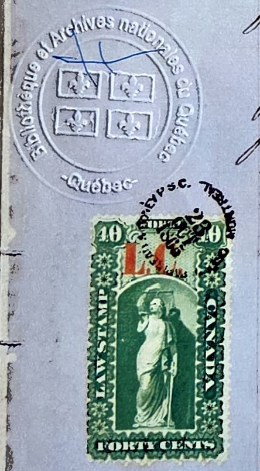

My plan for the next blog post was to explain how I found my great-grandfather's (George) baptism record. However, I have something more exciting to share! I finally received a certified copy of Jules' baptism record.

I ordered it the first week of February, with the very kind help of the Reddit sub-thread that explained in step-by-step detail how to order it using the French online form. A couple of weeks after I ordered it, BAnQ (the National Library and Archives of Québec) announced the [cost of the certified copies was increasing](https://www.reddit.com/r/Canadiancitizenship/comments/1renmpk/update_to_qu%C3%A9bec_records_requests/) from about \$35 plus shipping to \$350 plus shipping. Yikes! I wasn't sure if the price change was retroactive, which was a bit concerning.

Initially, I thought I needed the certified record for my citizenship application. Once I had the rest of my application ready to go, I decided that I didn't want to wait any longer to hear back from the archives. Reddit users were suggesting it was taking longer than a month (at that time) to get a response. In my cover letter of my application for citizenship, I explained that I had requested the certified copy of the baptism from the archive and that I would upload the official document once it arrived. In it's place, I offered the version of the record I found on FamilySearch.org and the url link to that version. It turns out, [my application was approved](https://joannapepin.com/posts/woke-up/) without the official copy.

I received an email from the archives the first week of May noting that they had located the record and would mail it to me. And, the best part, they were charging me the \$35 fee. Wonderful! I paid it immediately and then waited anxiously for it to arrive in the mail. Unfortunately, it got misdelivered to a nearby building and took an extra week to find its way to me.

It came with a cover page, which Chris and I did our best to translate.

{width="75%"}

*October 23rd, 1865 (date of this initial page) Register presented by \[Name\] priest, of the parish of St. Francois D’Assise of Loungue Pointe, in the county of Hochelaga, containing fourteen leaflets including this one, for registering the acts of Baptisms, Marriages, and Burials, in this parish during the year eighteen hundred sixty-six.*

*Given and sealed in Montreal, under our signature and seal of the superior office of the District of Montreal, in this part of Canada, formerly known as lower Canada.*

The cover page also included a Law Stamp, which was used as [proof of payment of a fee or tax](https://canadianphilately.blogspot.com/2015/10/collecting-canadas-revenue-stamps.html). 

{width="50%"}

The content of the baptism record we found online matched the copy we received. The [text is all the same](https://joannapepin.com/posts/jules/) (he was the 46th recorded birth that year), but in this version, François-Jules Pepin's record doesn't appear at the bottom of the page! It turns out the pages were so long that that the online version was just part of the page. Who knew? 

{width="75%"}

