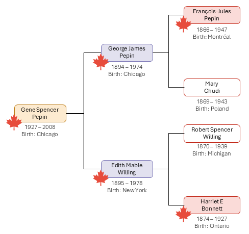

It's official! I'm a Canadian citizen!

Prove Canadian ancestry line through my paternal grandfather, Gene Pepin. 

While neither of his parents were born in Canada, his paternal grandfather and maternal grandmother were both born in Canada. That means his parents were both first generation Canadians.

In 2009, Citizenship, Immigration and Multiculturalism Minister Jason Kenney [released a commercial](https://www.canada.ca/en/news/archive/2009/04/will-you-wake-up-canadian-minister-kenney-launches-video-raise-awareness-new-citizenship-law.html) to announce changes to Canada's citizenship law. The aim of the video was to make people aware that the first generation of people born outside of Canada (on or after January 1, 1947) to Canadian parents were entitled to citizenship. 

As it happens, the 2009 revision to the citizenship law limited citizenship by descent to the first generation born outside Canada. This restriction was overturned by Canada's supreme court and was removed from the Citizenship Act with the implementation of Bill C-3 in December of 2025. 

Which make my grandfather Canadian, my father Canadian, and me Canadain!

Happy Opening Day! 