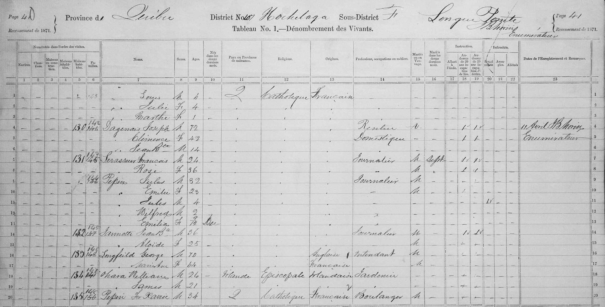

I have always been told that my dad's ancestry was likely French Canadian, but I never had specific details. I excitedly took a picture outside a cute boutique, named [*Maison Pepin*](https://maps.app.goo.gl/GMrqvKgumGnDHnGW7) on a trip to Montréal. When returning from another trip to Montréal, an airline check-in agent once teased me about my pronunciation of my last name. However, I didn't really know how far back in my family line I'd have look to establish a Canadian ancestor.

To begin my search, I started by looking for my grandfather's, Gene Pepin, birth certificate. A Google search eventually indicated it was accessible for free from a public library (library’s are the best!) on [FamilySearch.org](FamilySearch.org). It turns out that FamilySearch.org is run by the Church of Jesus Christ of Latter-day Saints, who aim to create the largest global collection of genealogy records. 

Once I found his birth certificate, I then knew his parents: George James Pepin (father) and Edith Mable Willing (mother). So, I typed George Pepin into FamilySearch.org (FS) which indicated that George was born in Chicago. The exciting part came next: his family tree populated on the website and it showed that George’s father, Julius Pepin, was born in Canada!

Proof of Canadian citizenship required submitting birth records for everyone in the ancestry line back to and including the Canadian ancestor. At this point, I had mine and my dad's, and now my grandfather's birth certificate. I needed to find my great grandfather’s (George) and his father’s (Julius).

I decided to start with Julius, my grandfather’s grandfather, because if I couldn't prove he was born in Canada, the rest of the application was pointless. The [1871 Canadian Census record](https://recherche-collection-search.bac-lac.gc.ca/eng/Home/Record?app=census&idNumber=38919241&ecopy=4395468_00379) record, linked to Julius on FS, indicated he was 4 years old at the time. Aha, so now we had a birth year -- Julius was likely born in 1866/67! The census record also showed the family was living in the district of Hochelaga, neighborhood of Longue-Pointe. A Google map search revealed this area is essentially in the city of Montréal!

{width="75%"}

In Québec, the province in which Montréal is located, vital records (i.e., births, marriages, deaths) were [administered by the church until 1926](https://www.familysearch.org/en/wiki/Qu%C3%A9bec_Vital_Records_and_Church_Records_-_International_Institute). According to the [Reddit group](https://www.reddit.com/r/Canadiancitizenship/), I learned that this that meant I would need to find a baptismal record. Finding a baptismal record requires finding the church the family attended. 

The 1871 showed the family was Catholic, so the next step was to find Catholic churches in the area. This proved difficult, because Google maps only shows *current* churches. I needed to find Catholic churches that were in existence in 1866-67. 

We found marriage card for his parents. Jan 9, 1866. Sparse information Pointe-aux-Trembles – name of neighborhood? church? had marriage date so thought maybe baptism would take place at same church. Chris found [this webpage](https://gcatholic.org/churches/local/mont2#353) that includes dates the churches were founded by city. two churches in neighborhood with this name – first church founded in 1950s. Not it. Next church - 1678. Promising! Same name as neighborhood. Found familysearch records by church and found marriage record! Look through all baptisms and nothing. Sad.

We then zeroed in on the neighborhood they were living in 1871 census. Longue Pointe neighborhood. Back to historical map: A few chuches to choose from. Identified several in area and cross-checked with FamilySearch that had baptism records. 

Finally found it! 
[Church of St. Francis of Assisi](https://gcatholic.org/churches/canada-quebec/13449)
