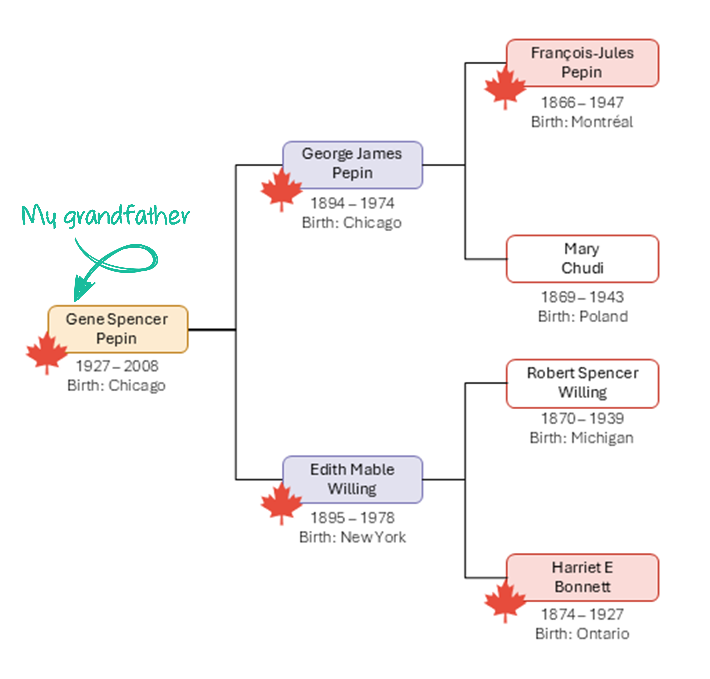

It's official! I woke up a Canadian citizen! 

It's been a bit disorienting to go from a [text about a Reddit thread](https://joannapepin.com/posts/welcome/), to [hopefulness about my citizenship status](https://joannapepin.com/posts/status/), to official documentation as a Canadian citizen in a matter of months.

I was able to demonstrate my Canadian ancestry through my paternal grandfather, Gene Pepin. While neither of my grandfather's parents were born in Canada, his paternal grandfather and maternal grandmother were both born in Canada. That makes his parents first generation Canadians. 

**What made this possible?**  

Canada updated its citizenship law in 2009 to clarify how citizenship by descent worked. The change was meant to ensure that people born outside Canada to Canadian parents could still be recognized as citizens. That revision included a critical limitation: it restricted citizenship by descent to only the first generation born abroad. This restriction remained in place until Canada’s Supreme Court struck it down, leading to its removal through [Bill C‑3 in December 2025](https://www.canada.ca/en/immigration-refugees-citizenship/news/2025/12/bill-c-3-an-act-to-amend-the-citizenship-act-2025-comes-into-effect.html).

Until December of 2025, my legal Canadian ancestry ended with my great grandfather. Removing the first generation rule made my grandfather Canadian, which made my father Canadian, and which ultimately makes me Canadian! 

To prove it, I spent a couple of intense weeks tracking down records: a 1866 Catholic baptism in Montréal (more on that in the next post) and my great‑grandfather’s 1896 Chicago baptism record. I even had a second qualifying line through my grandfather’s maternal side, though that one has been trickier to document.

Back when the 2009 law was first introduced, Citizenship, Immigration and Multiculturalism Minister Jason Kenney released a [public awareness commercial](https://www.canada.ca/en/news/archive/2009/04/will-you-wake-up-canadian-minister-kenney-launches-video-raise-awareness-new-citizenship-law.html) to explain who might “wake up Canadian.”

<iframe width="560" height="315" src="https://www.youtube.com/embed/eDeDQpIQFD0?si=FOxXKl0nbZRWK06x" title="YouTube video player" frameborder="0" allow="accelerometer; autoplay; clipboard-write; encrypted-media; gyroscope; picture-in-picture; web-share" referrerpolicy="strict-origin-when-cross-origin" allowfullscreen></iframe>

I had no idea in 2009 that I too was a "lost Canadian." But I woke up one morning this week to an email with instructions on how to download my Canadian citizenship certificate. No more work-permit renewals and no more stress about being too old to be eligible for Permanent Residency. I have been found.

P.S. Happy Opening Day! Go Jays!
